# README.md

## 安装使用文档

### 概览

技术栈：使用`solidity`语言的`truffle`框架，项目模板使用`react`框架。

### 必要的环境

#### 区块链和web环境

1. `Chrome`浏览器安装`MetaMask插件`

2. `Solidity`开发后端

3. `truffle框架`:`npm install -g truffle`

   `Truffle Boxes`是truffle框架集成的脚手架工具，可以使用这个脚手架快捷的生成完备的DAPP的项目结构，其中集成了前端视图、编译压缩工具等。可以在`http://truffleframework.com/boxes/`中查看并选择合适的模板来进行项目初始化。

4. `truffle unbox react`

5. `Ganache localhost/Ropoetn Test Network`

#### Ganache本地测试网络

大家可能会有疑问，已经有 Ganache 工具，为什么还需要借助 Metamask？这是因为 Ganache 是用于开发调试的工具，并没有集成 **Ropsten** 测试网和 **Mainnet** 主网的链接功能。而 Metamask 中已经做了集成（注意其中的 Ropsten 为选中状态）

1. `unzip Demo.zip`

2. `npm install`

3. `truffle compile`

4. `truffle migrate`

   需要重新部署合约时需要输入`truffle migrate --reset`

   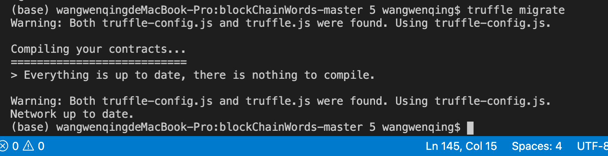

   Migrate 成功后的结果如下图所示，需要根据其中的contract address对应修改app.js中的合约地址

   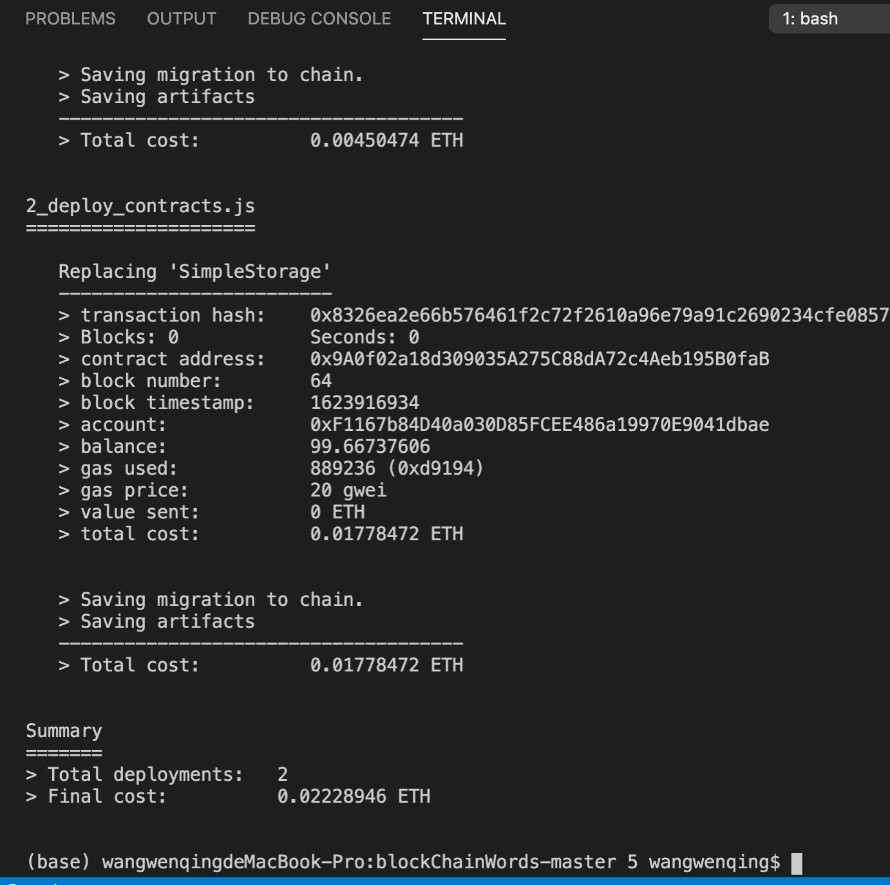

5. `cd client`

6. `ipfs init| ipfs damemon `

   防止`ipfs`端口碰撞，可以修改`ipfs配置文件`

7. `npm run start`

   ganache界面如图所示，配置metamask时需要导入mnemonic助记词并配置网络，连接当前显示网络

   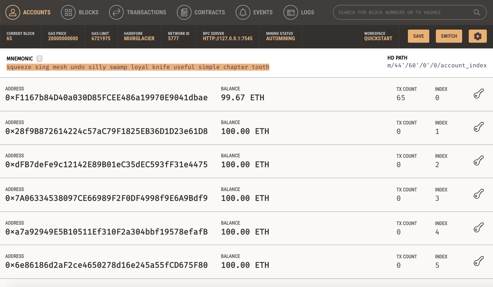

#### Ropsten Test测试网络

Ropsten也是以太坊官方提供的测试网络，是为了解决Morden难度炸弹问题而重新启动的一条区块链，目前仍在运行，共识机制为PoW。测试网络上的以太币并无实际价值，因此Ropsten的挖矿难度很低，目前在755M左右，仅仅只有主网络的0.07%。这样低的难度一方面使一台普通笔记本电脑的CPU也可以挖出区块，获得测试网络上的以太币，方便开发人员测试软件，但是却不能阻止攻击。

PoW共识机制要求有足够强大的算力保证没有人可以随意生成区块，这种共识机制只有在具有实际价值的主网络中才会有效。测试网络上的以太币没有价值，也就不会有强大的算力投入来维护测试网络的安全，这就导致了测试网络的挖矿难度很低，即使几块普通的显卡，也足以进行一次51%攻击，或者用垃圾交易阻塞区块链，攻击的成本及其低廉。

2017年2月，Ropsten便遭到了一次利用测试网络的低难度进行的攻击，攻击者发送了千万级的垃圾交易，并逐渐把区块Gas上限从正常的4,700,000提高到了90,000,000,000，在一段时间内，影响了测试网络的运行。攻击者发动这些攻击，并不能获得利益，仅仅是为了测试、炫耀、或者单纯觉得好玩儿。

1. `HDWalletProvider`：`npm install truffle-hdwallet-provider`

2. 注册`infura`: https://infura.io/

3. 修改`truffle-config.js`

   如果不修改`truffle-config.js`会遇到的报错

   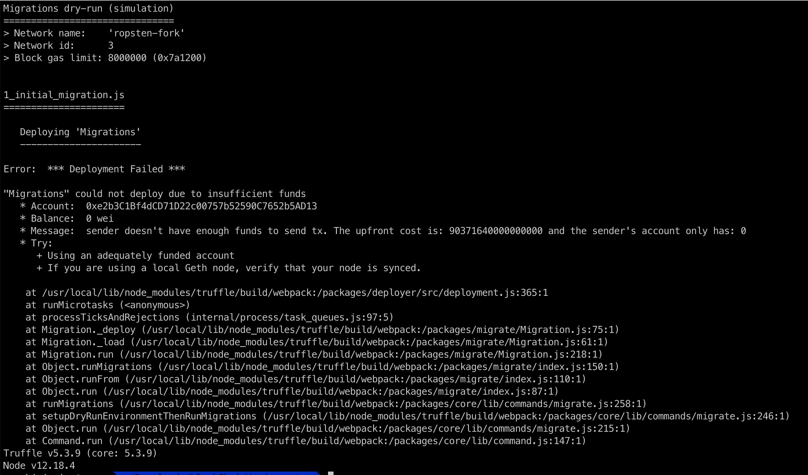

查了万能的StackOverflow,发现 问题出在区块的数量上，在`truffle-config.js`里更改network数量就可以了。

```javascript
const path = require("path");
const HDWalletProvider = require("truffle-hdwallet-provider")
// var HDWalletProvider = require("truffle-hdwallet-provider");  // 导入模块
var mnemonic = "ranch dignity vendor news dutch guide web south grit develop monster excite";  //MetaMask的助记词。 

module.exports = {
        // See <http://truffleframework.com/docs/advanced/configuration>
        // to customize your Truffle configuration!
        contracts_build_directory: path.join(__dirname, "client/src/contracts"),

        networks: {
                ropsten: {
                        provider: function () {
                                
                                return new HDWalletProvider(mnemonic, "https://ropsten.infura.io/v3/7041b82d1d9a4c3798fb03f2929be3d0", 0, 3);
                        },
                        network_id: "*",  // match any network
                        gas: 3012388,
                        gasPrice: 30000000000
                },
              
        }
};

```

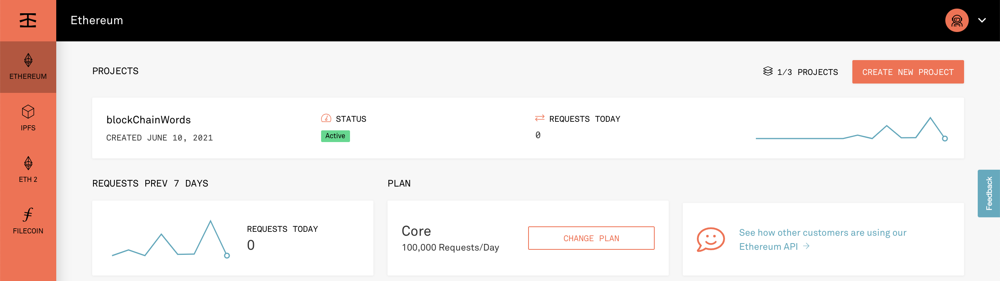

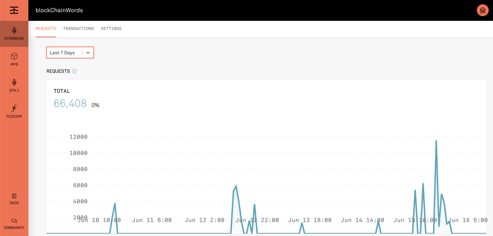

### ipfs环境安装与配置

0. ````shell
   # update packages
   sudo apt update
   # install golang
   sudo apt install golang-go -y
   # install git
   sudo apt install git -y
   # install ipfs-update
   go get -u github.com/ipfs/ipfs-update
   # add ~/go/bin into .bash_profile
   echo "export PATH=$PATH:$HOME/go/bin" >> .bash_profile
   # add GOPATH into .bash_profile
   echo "export GOPATH=$HOME/go" >> .bash_profile
   source .bash_profile
   ````

   安装ipfs：

   ```shell
   $ ipfs-update install latest
   fetching go-ipfs version v0.4.20
   binary downloaded, verifying...
   success! tests all passed.
   installing new binary to /home/Like/go/bin/ipfs
   checking if repo migration is needed...
   Installation complete!
   ```

   初始化 ipfs：

   ```shell
   $ ipfs init
   initializing IPFS node at /home/Like/.ipfs
   generating 2048-bit RSA keypair...done
   peer identity: QmS5DQXifPi4cBRDYhVLWbSAYcMEvt4J6RdBs4mCMr7oUP
   to get started, enter:
           ipfs cat /ipfs/QmS4ustL54uo8FzR9455qaxZwuMiUhyvMcX9Ba8nUH4uVv/readme
   ```

1. `npm install --save-dev ipfs-api`

2. ```shell
   # 拉取go-ipfs镜像
   docker pull ipfs/go-ipfs:latest
   # 配置staging和data的volume映射文件
   ipfs_staging=/tmp/ipfs_staging
   mkdir -p $ipfs_staging
   ipfs_data=/tmp/ipfs_data
   mkdir -p $ipfs_data
   # 启动ipfs节点
   docker run -d --name ipfs_host \
   -v $ipfs_staging:/export \
   -v $ipfs_data:/data/ipfs \
   -p 4001:4001 \
   -p 127.0.0.1:8080:8080 \
   -p 127.0.0.1:5001:5001 \
   ipfs/go-ipfs:latest
   ```
   
3. `ipfs`对CORS进行配置(不配置在后面会报错)

	```shell
   ipfs config --json API.HTTPHeaders.Access-Control-Allow-Origin "[\"http://example.com\"]"
   ipfs config --json API.HTTPHeaders.Access-Control-Allow-Credentials "[\"true\"]"
   ipfs config --json API.HTTPHeaders.Access-Control-Allow-Methods "[\"PUT\", \"POST\", \"GET\"]"
   ```

5. 关闭ipfs节点，然后输入下面配置，然后再启动节点

   ```shell
   ipfs config --json API.HTTPHeaders.Access-Control-Allow-Origin "[\"*\"]"
   ipfs config --json API.HTTPHeaders.Access-Control-Allow-Credentials "[\"true\"]"
   ipfs config --json API.HTTPHeaders.Access-Control-Allow-Methods "[\"PUT\", \"POST\", \"GET\"]"
   ```

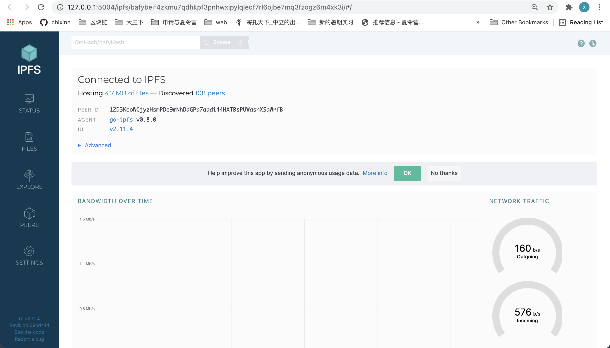

### 前端

React是一个前端UI库。我对React的理解主要就两点：**组件化和数据驱动**，在React基础上，其周边生态提供了更多强大功能：状态管理、路由、React Native等。

### 环境配置的踩坑与细节

1. 垃圾`npm`

2. `node.js`包管理

3. `ipfs`端口`config`的问题，5001和8080端口都冲突的问题。

4. `ropothen test`测试网络，不需要显示的指定contract address+Ganache需要显实contract address双线并行与`Metamask network `connect的问题

5. `truffle react `新旧包版本兼容与否的问题

   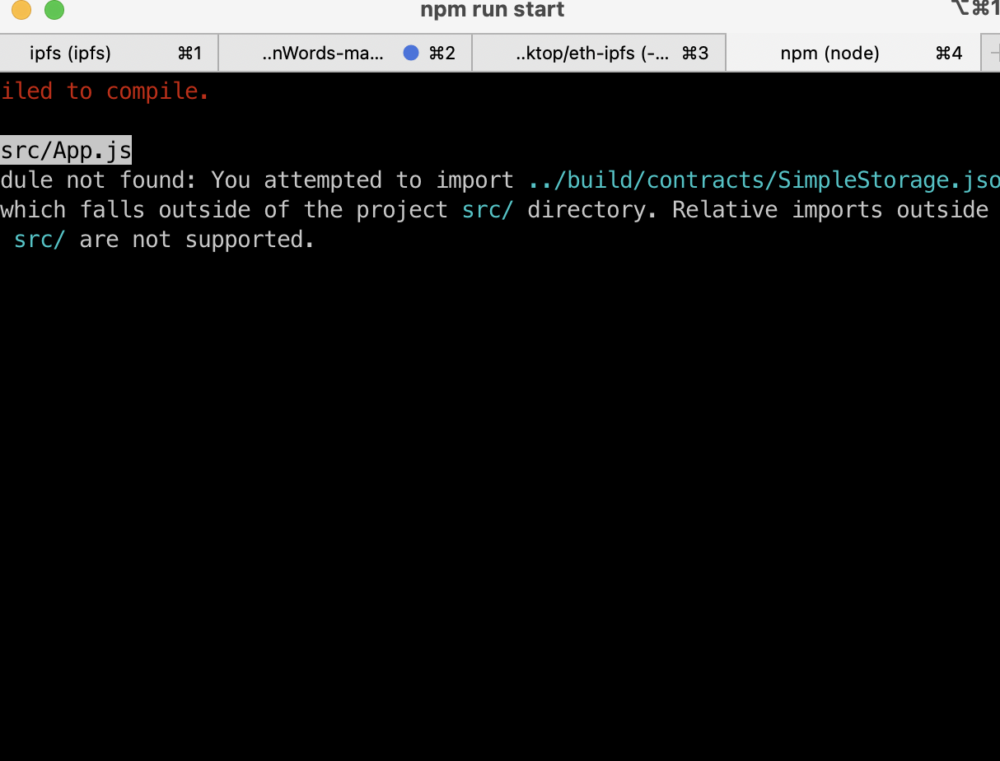

6. `truffle -migrate`测试网络经常time-out的问题

## 项目选题

1. 项目有使用区块链平台的必要性

   毕业季留言板，为什么要在区块链上使用留言功能、点赞排名功能和图片上传功能。

   DAPP结合IPFS去中心化图床，图片为什么不用string Hash而是要使用ipfs，为什么不将图片这种大数据直接存入以太坊。

   点赞功能实时反应top榜单（类似于学长实验课上的投票机制，在期末项目中，我们也要学以致用，将实践与理论相结合）

2. 项目完成度比较高，有友好的用户交互界面

   从用户体验的UI设计

3. 新颖和工作量

## 项目使用区块链平台的必要性

### 区块链应用

​	区块链应用技术的突破点一定会在中心化应用做的不好的地方，而在中心化应用能做好的地方，目前为止适合用于区块链的不是很多。而从技术角度来看，区块链技术最终要解决的问题，是**信任**的问题。

#### 毕业季留言板

一个比较著名的CoinBase留言是矿工七彩神仙鱼结婚时在区块链上的秀恩爱。

> “我当时没有买钻戒，就把这个区块当钻戒了，因为我觉得这个可能更为永恒，只要网络存在，人类文明存在，这个誓言就会永远不会消失。”

收款地址是1Love YoU开头的八位虚荣地址，这个地址本身也比较难得，我现在的电脑估计要算上几年才能算出来。

现在正好是2021年毕业季，我们也想借助区块链留言板伪匿名的形式，帮助同学们说出心中想说的话～部署在测试网络，且测试网络已经用**水龙头**灌了很多钱，所以同学们就可以畅所欲言。

《永存的留言》是一个基于以太坊的在线留言平台。它的功能十分简单–用户可以在平台上进行留言，平台每10s随机的展示留言内容。
但是它的特点在于，利用区块链的特性，保证了数据的真实性、完整性和安全性。

世界上任何人都可以在墙上写字，也可以从墙上写字。留言板将区块链技术不可篡改性和留言板可以在区块链中永久的留下自己的信息。在编写消息时，它将永久保留在区块链上。这就保证了区块链上所存储的信息的唯一性，因此，我们小组认为是不是可以在区块链上留下自己独特的足迹

真实应用场景的区块链留言板中，有`wallet.la`的例子，熟悉BTC的朋友应该都知道，`wallet.la`是一个`off chain`钱包，不需要存币就可以在区块链上留言。通过对比特币协议的操作，`wallet.la`已经可以让小伙伴们在比特币区块链上的保存自己的信息了。现在只需发送一笔交易就可以留言在区块链上。注意，利用wallet.la在blockchain上留言和使用blockchain.info钱包留言完全不是一个级别，blockchain.info上面的留言只保存在自己服务器上。而wallet.la可以让留言永久保存在区块链上。

#### 结合IPFS去中心化图床

核心思路：文件存在ipfs，然后对应的QmHash存在合约里。

与语言文字一样，图片也可以表达同学们想表达的东西，所以我们的留言板在文字留言的基础上还增加了图片留言的功能。

但是我们没有单纯的将图片留言仅仅简单的写成二进制字符串的形式存在数组中，而是采用了IPFS的方式。

下面先来谈谈ipfs介绍以及为什么要采用ipfs？

> IPFS与区块链是未来的最高形态

[IPFS与区块链是未来的最高形态](https://www.bilibili.com/read/cv8199502/)

##### 什么是IPFS

IPFS是协议实验室为分布式网络开发的一种协议，其目的是通过建立一个更分散的网络来颠覆现有的现有的中心化网络。IPFS可以解决当前中心化存储中存在的一些问题，保证数据不会丢失，比中心化存储的商业成本更低，而非中心化存储方案将成为未来云存储的主流选择。IPFS本着分布式、点对点的思想，鼓励硬盘提供商多样化，采用 **filecoin**激励机制，完善存储市场竞争机制，降低存储门槛，避免垄断，调动网络中各节点的积极性，提高资源利用率，使数据分散存储，同时保证用户隐私。

IPFS的**最大优点**是能够将公共的高活跃文件统一地存储和分发，这样既节省了存储空间，又节省了带宽，并提供了一条稳定、高速的分发途径

比如我曾经写过个人博客，在写博客不久就遇到了需要引用大量图片的尴尬境地。如果所有图片都上传至 github，会使得后期代码仓库越来越臃肿，在天朝这个网速让人捉急的地方，需要更好的方法去解决这个问题。第一反应想到的是使用对象储存服务，然后配合 CDN，部署一个图床。通过多方面了解，七牛和腾讯云都是不错的选择（阿里云太贵）。而应用IPFS配置自己的去中心化图床，通过 ipfs 在自己的服务器上开个节点，把图片传到 ipfs 公网上去，这样就可以随时随地访问了，这样类似于实现了 CDN 的作用。

##### IPFS与区块链

为什么不区块链直接存储图片？

目前区块链的存储费用实在是太高了，以以太坊网络为例子，可以先将图片base64后，存储在转账的Input Data中，不过假设一张图片1M，base64后通常会变大，这个存储费用就很昂贵了。

1. 区块链是一种记录交易数据和保存区块内历史的技术。IPFS被设计用来替代 HTTP, HTTP是用于共享和存储介质的点对点方法。

2. 区块链技术虽然不适合存储大量数据，但 IPFS被区块链应用程序所使用，该应用程序需要可公开访问的数据库，可以将大量数据存储在不同的节点上，并利用区块链的“痛证经济”来保持节点的联机和安全。

3. 在区块链上输入数据后，尽管无法更新或删除，但是在 IPFS中，网络数据只能在其他节点选择不重新托管的情况下被删除，并且 IPFS支持版本控制。如此看来，区块链与 IPFS之间既有区别又能协同工作，达到相得益彰的实用效果，这也印证了为何 IPFS，或者区块链未来发展的最高形态。 

所以：区块链+IPFS=YYDS

#### 区块链投票

投票是一个非常需要**过程完整性**的过程。投票的结果必须是正确的，而且必须有一个透明的过程来保证这一点，这样每个人都可以相信这个结果是正确的。不应该存在成功地干涉任何人的投票意愿或阻止他们的选票被统计的可能性。

区块链是一种为过程完整性提供保证的技术。如果某个过程运行在区块链上，则能保证该过程会根据一些预先商定的代码运行，并提供正确的输出。没有人可以阻止其执行，没有人可以篡改这一执行，也没有人可以审查和阻止任何用户的输入被处理。

在课上，我们了解了范维学长为我们简单介绍的投票功能，我们将这个伪匿名投票功能，应用到我们的最终项目中，我们将投票的逻辑，创新性的应用到了点赞功能上。

## 核心代码与项目结构

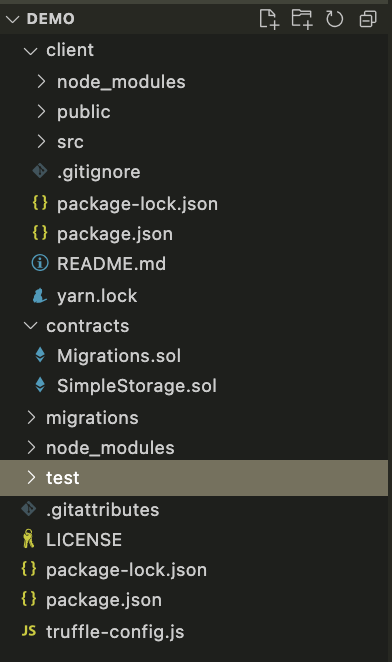

### 后端- contract：SimpleStorage.sol

#### Step1.定义结构体和成员变量

结构体：留言        属性：留言内容、留言者地址、留言时间、点赞数

数组：wordArr存储当前所有留言内容及对应属性

​			topThree存储当前排名最高三条留言内容及对应属性

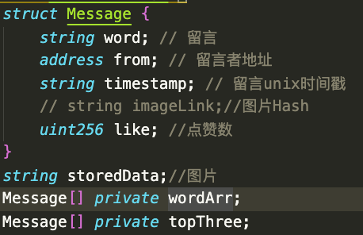

#### Step2.将留言存储到区块链中

传入参数留言内容s， 留言时间t，构造相应的结构体，并将该结构体push到数组wordArr（用于存储所有留言，及其对应属性）中。

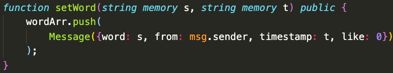

#### Step3.给留言点赞

遍历所有留言，找到与当前留言发送者对应的留言，并将其属性点赞数加一，同时更新点赞数排名前三的信息，一开始没有点赞数排名前三的数组topThree中没有留言，每点赞一个留言就将其push到topThree的数组中，后来topThree长度达到3，就找出topThree中点赞数最少的留言与当前点赞留言的点赞数比较，如果低于当前点赞的留言，就替换掉当前点赞数最低的留言。

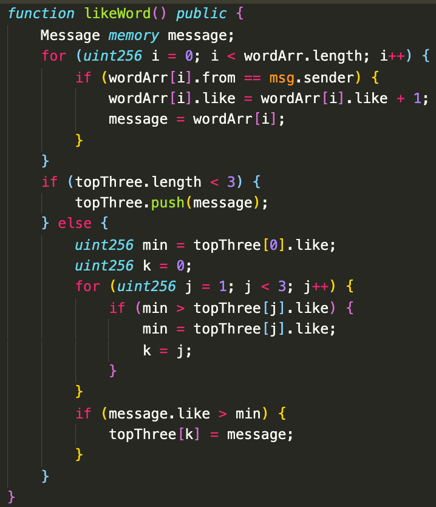

#### Step4.随机获取一条区块链上的留言

根据传入的随机数，随机从区块链的数组中选取一条留言作为返回值，返回给对应前端。如果当前区块链上还没有留言则返回实现设定的默认值。

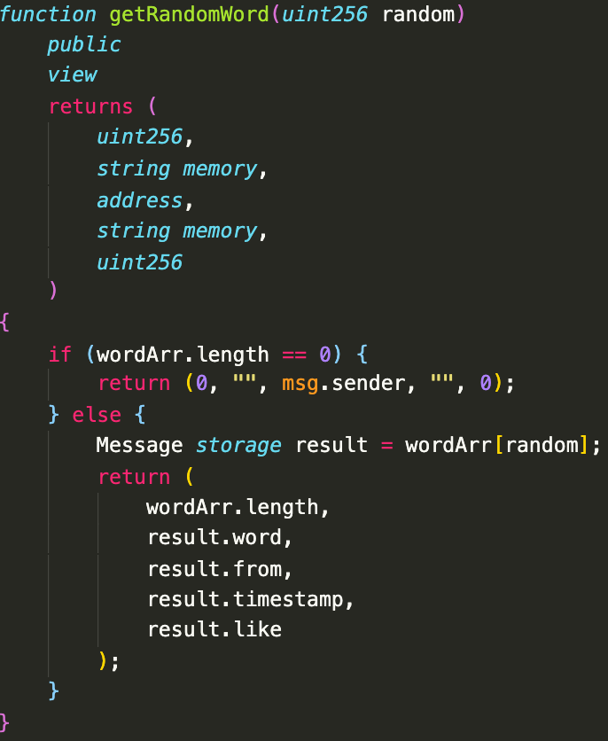

#### Step5.获取点赞数排名最高的三条留言

在点赞的时候，topThree的数组中已经存储了当前点赞数最高的三条留言，根据传入的随机数，即可随机返回topThree中对应的某一条留言。

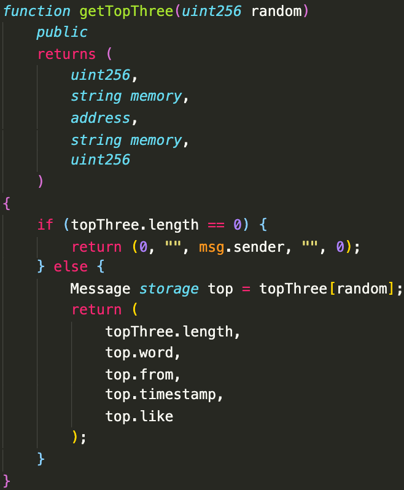

#### Step5.将照片哈希值存储到区块链

将留言信息写入到区块链(数据库)


将图片（IPFS返回的Hash值信息写入到区块链(数据库))

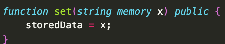

### 后端踩坑记录：

1、一开始想用mapping来存储对应的like（点赞数）和message的对应关系。后来也尝试过用address和like进行映射，想减少遍历数组，找到对应留言，并增加其点赞数所带来的开销。但都不可行，可能实现的逻辑存在问题。后来还是将like放在结构体中，采用遍历方式增加点赞数，也许会有更好的办法帮助实现点赞功能。

2、一开始想一次性返回点赞数排名前三的留言，后来发现solidity不支持返回结构体数组，最后想到的实现方法就是从以太坊上点赞数排名靠前的留言中随机选取一条数据作为返回值，返回给前端。

### 前后端交互框架：`truffle box react:`App.js

通过头部引用可以看出前端与合约交互的流程：

1. 首先前端使用了`react`框架；
2. 第二句`import SimpleStorageContract from '../build/contracts/SimpleStorage.json'`导入的实际上是上步合约代码编译后产生的`json`文件，该文件中包含两个重要信息：一个是`abi`字段，通俗讲就是合约代码编译后产生的二进制接口，其中会声明合约代码暴露的可供调用的接口；另一个是`bytecode`字段，为合约代码的十六进制码。通过这两个重要信息就可以对一个合约进行相应操作。
3. 导入了`web3.js`，`web3.js`是以太坊提供的一个JavaScript库，他封装了以太坊的`JSON RPC API`，提供了一系列与区块链交互的JavaScript对象和函数，包括查看网络状态，查看本地账户、查看交易和区块、发送交易、编译/部署智能合约、调用智能合约等，其中最重要的就是与智能合约交互的API。

明白了前端与合约交互的原理，剩下来的就是使用`react`语法结合`web3.js`提供的接口对合约操作即可。

将`App.js`文件进行一些修改，实现：在网页输入框中输入值，点击确定后可以修改合约中的值（写操作），写入成功后读取合约中的新值，并自动显示到网页（读操作）,也就是通过前端网页对上述合约中定义的的`set()`和`get()`两个方法的调用。

最终App.js如下，主要修改分以下几点:

- 将部署完成的合约地址作为变量`contractAddress`保存，以供后续调用合约使用。
- 声明`simpleStorageInstance`变量，作用是通过合约地址得到合约实例后将合约实例保存起来，方便后续调用。
- 添加输入框及按钮，点击按钮时读取输入框的值，通过合约实例及web3提供的方法修改合约中的`storedData`值。
- 使用`Promise`语法，当写操作成功后，执行读操作，并在读取成功后，修改`react`的组件状态`state`中的变量值，使前端显示自动更新

### 前端

在App.js 在对应的css文件中进行文字图片格式的调整

在render()函数中进行前端的编写

1.首先判断是否需要跳转至榜单页面

2.css编写格式 首先创建container弹性容器对背景大小样式进行初始化

同一个css格式如showtops 可通过.showtops div/.showtops button/button:hover 进行按钮文本框的配置

3.动画效果：借助aphrodite包实现

初始化全局变量style定义样式

通过this.state中的in和out变量来调用相应的动画样式

4.按钮调用 onClick={() => this.setWord()}调用相应的函数，进行相应的计算、赋值、更新、跳转，并显示

### 前端踩坑记录

debug工具使用google 检查的console界面查看错误详情

1.无法对文字进行渲染

出错原因主要有：

1）静态文件路由有误

2）div标签的对应关系有误

2.variant variation  particles-bg和本地包不兼容的报错 换了一个包react-particles-js并进行参数配置

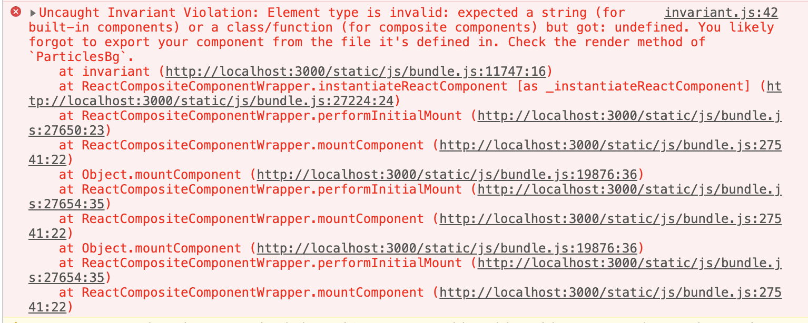

报错代码

```js
 import ParticlesBg from "particles-bg";
 class Top extends React.Component {
     constructor(props) {
         super(props);
         this.state = {  };
     }
     componentDidMount(){
         //地址栏跳转传参
         // console.log(this.props.match.params);

         //函数跳转传参
         console.log(this.props.history.location.state);
     }
     render() {
         return (   
                  <header>
                    <ParticlesBg type="circle" bg={true} />
                   </header>
            
         );
     }
 }
```

3.路由跳转出错

react--js实现界面跳转

只写router.js配置路由路径无法正常跳转

使用push成功

4.使用npm i 安装包之后任出现module not found

需要npm install对应包即可解决问题

## 项目人员组成

分工明确，节奏稳中有进

敏捷开发

前端、后端、solidity、区块链、coordinator

Xsh:后端+前端

wwq:后端+前端

Cxn:后端+前后端交互框架

## 提交材料

- 代码
- 项目文档
- 需求文档

---

桃子

1. Runnable Demo可以真实跑，不是ppt大赛也不是前后端没有连起来。

## 总结

1. 最终的成果虽然还不够完善，仍然还有一些bug和冲突的存在，但是这次期末作业是很好的经验，加深了对区块链数据库应用的理解，也体会到了在一个项目中区块链和分布式数据库所起的关键性作用，对于今后的以区块链和分布式数据库为基础的项目做了很好的铺垫。
2. 基于以太坊开发DAPP实际上比较简单，重点是在合约的逻辑性、安全性上。从这也可以看出来以太坊生态的强大和完整，便捷完备的开发语言、工具，确实是目前继大饼之后最牛的项目。
3. `solidity`中的字典不支持枚举/遍历（榜单函数的实现逻辑中）
4. `solidity`中对外暴露的函数不能返回字典/结构体/数组（简单的数字类型数组除外）

这两点实在是让我觉得`solidity`失去这两个语言特性，使得智能合约的功能复杂度上限制很大。

